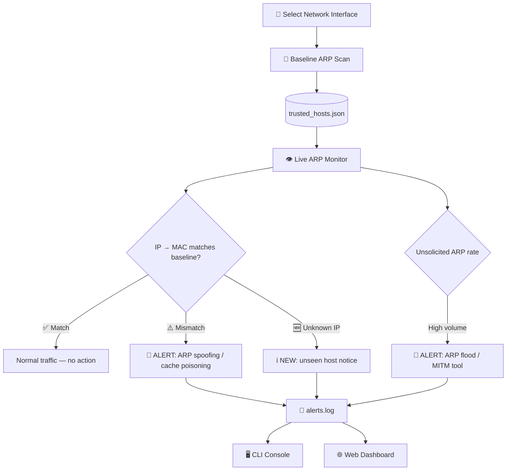
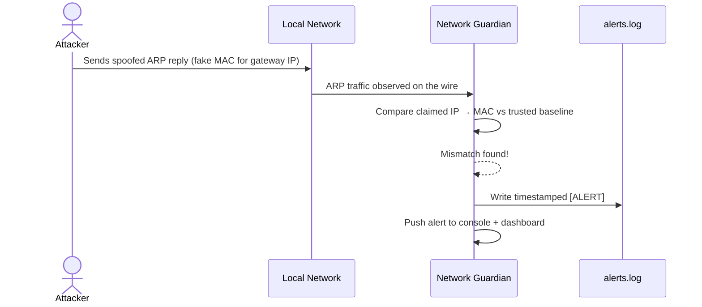

<div align="center">


</div>

<br/>

```
 ▄▄▄▄▄▄▄▄▄▄▄
█           █
 ▀▄▄▄▄▄▄▄▄▄▀
  █       █
   ▀▄▄▄▄▄▀
    █   █
     ▀▄▀

███╗   ██╗███████╗████████╗     ██████╗ ██╗   ██╗ █████╗ ██████╗ ██████╗ ██╗ █████╗ ███╗   ██╗
████╗  ██║██╔════╝╚══██╔══╝    ██╔════╝ ██║   ██║██╔══██╗██╔══██╗██╔══██╗██║██╔══██╗████╗  ██║
██╔██╗ ██║█████╗     ██║       ██║  ███╗██║   ██║███████║██████╔╝██║  ██║██║███████║██╔██╗ ██║
██║╚██╗██║██╔══╝     ██║       ██║   ██║██║   ██║██╔══██║██╔══██╗██║  ██║██║██╔══██║██║╚██╗██║
██║ ╚████║███████╗   ██║       ╚██████╔╝╚██████╔╝██║  ██║██║  ██║██████╔╝██║██║  ██║██║ ╚████║
╚═╝  ╚═══╝╚══════╝   ╚═╝        ╚═════╝  ╚═════╝ ╚═╝  ╚═╝╚═╝  ╚═╝╚═════╝ ╚═╝╚═╝  ╚═╝╚═╝  ╚═══╝
```

<div align="center">

[](https://www.python.org/)
[](https://scapy.net/)
[](https://flask.palletsprojects.com/)
[](https://pypi.org/project/colorama/)
[](https://npcap.com/)

[](LICENSE)
[](https://github.com/ANIKETCHAND/network_guardian-5-/stargazers)
[](https://github.com/ANIKETCHAND/network_guardian-5-/network/members)
[](https://github.com/ANIKETCHAND/network_guardian-5-/issues)

<sub>🐧 Linux &nbsp;|&nbsp; 🍎 macOS &nbsp;|&nbsp; 🪟 Windows &nbsp;— &nbsp;runs anywhere Python + Npcap/libpcap does</sub>

</div>

<br/>

**Network Guardian** is a **defensive**, terminal-first Python tool that watches your local network for **ARP spoofing** and **Man-in-the-Middle (MITM)** activity in real time. It builds a trusted baseline of every device on your LAN, then continuously listens for ARP traffic that doesn't match — the classic signature of an attacker trying to poison your ARP cache and hijack traffic.

> [!IMPORTANT]
> Network Guardian **only listens**. It never redirects, intercepts, injects, or harvests traffic. It is a *detector*, not an attack tool.

> [!WARNING]
> For use only on networks you **own** or are **explicitly authorized** to monitor. Unauthorized network monitoring may be illegal in your jurisdiction.

---

## 📚 Table of Contents

- [✨ Features](#-features)
- [🧠 How It Works](#-how-it-works)
- [🔁 Detection Flow](#-detection-flow)
- [🛠️ Tech Stack](#️-tech-stack)
- [📦 Installation](#-installation)
- [▶️ Usage](#️-usage)
- [🚨 Example Alert](#-example-alert)
- [🌐 Web Dashboard](#-web-dashboard)
- [🧊 Roadmap](#-roadmap)
- [⚠️ Notes & Limitations](#️-notes--limitations)
- [🤝 Contributing](#-contributing)
- [📜 License](#-license)

---

## ✨ Features

| | Feature | Description |
|---|---|---|
| 📡 | **Baseline Scanning** | Actively ARP-scans your subnet and records a trusted `IP → MAC` table |
| 👁️ | **Live ARP Monitoring** | Continuously sniffs ARP replies on the wire, comparing every claim to the baseline |
| 🚨 | **Spoofing Detection** | Flags an IP that suddenly claims a *different* MAC than the baseline — classic ARP cache poisoning |
| 🌊 | **Flood Detection** | Flags a MAC sending unusually high rates of unsolicited ARP replies — a common spoofing-tool fingerprint |
| 🆕 | **New Host Alerts** | Informational flags for brand-new devices that join the network (normal, not an attack) |
| 📝 | **Persistent Alert Log** | Every alert is timestamped and written to `alerts.log` for later review |
| 🌐 | **Web Dashboard** | Optional Flask-powered browser view of live alerts |
| 🎨 | **Colorized CLI** | Colorama-powered terminal output that's easy to scan at a glance |

---

## 🧠 How It Works

1. **Baseline scan** — actively ARP-scans your subnet and records a trusted `IP → MAC` table (`trusted_hosts.json`).
2. **Live monitor** — sniffs ARP replies on the wire and compares every `IP → MAC` claim against the baseline.
   - A different MAC claiming a known IP → logged as an **`[ALERT]`** (cache poisoning).
   - Abnormally high unsolicited ARP reply rate from one MAC → logged as an **`[ALERT]`** (flood / spoofing tool).
   - A brand-new host not in the baseline → logged as **`[NEW]`** (informational — normal when devices join).
3. **Alert log** — every alert is timestamped and written to `alerts.log`.

## 🔁 Detection Flow



<details>
<summary>🎬 Sequence view — a spoofing attempt getting caught</summary>



</details>

---

## 🛠️ Tech Stack

<div align="center">

| Technology | Role in the project |
|---|---|
|  | Core language |
|  | ARP scanning, sniffing & packet crafting |
|  | Lightweight web dashboard |
|  | Cross-platform colored terminal output |
|  | `trusted_hosts.json` baseline storage |
|  | Raw packet capture driver on Windows |

</div>

---

## 📦 Installation

```bash
git clone https://github.com/ANIKETCHAND/network_guardian-5-.git
cd network_guardian-5-
pip install -r requirements.txt
```

Scapy needs raw packet access:

| Platform | Requirement |
|---|---|
| 🐧 Linux / 🍎 macOS | Run with `sudo` |
| 🪟 Windows | Install [Npcap](https://npcap.com/#download) and run the terminal **as Administrator** |

---

## ▶️ Usage

```bash
sudo python network_guardian.py      # Linux / macOS
python network_guardian.py           # Windows (as Administrator)
```

| # | Menu Option |
|---|---|
| 1 | 🔌 Select network interface |
| 2 | 📡 Scan network (build trusted baseline) |
| 3 | 👁️ Start ARP spoofing / MITM monitor |
| 4 | 📜 View alert log |
| 5 | 🌐 Launch web dashboard |
| 6 | 🚪 Exit |

**Typical session:** select your interface → build a baseline while the network is known-clean → start the monitor → leave it running → check `alerts.log` or the live console for anything suspicious.

## 🚨 Example Alert

*(illustrative format — actual fields depend on your run)*

```text
[2026-08-14 10:32:17] [ALERT] Possible ARP spoofing detected!
    IP            : 192.168.1.1
    Baseline MAC  : AA:BB:CC:11:22:33
    Current MAC   : DE:AD:BE:EF:00:11
    >>> Someone may be impersonating your gateway!
```

## 🌐 Web Dashboard

Option `[5]` launches a lightweight **Flask** web dashboard so you can watch alerts and host status from a browser instead of the terminal — handy for keeping the monitor running headless while you check in from another device on the LAN.

---

## 🧊 Roadmap

Ideas for where Network Guardian could go next — contributions welcome!

- [ ] 🧊 **3D live network topology map** — an interactive Three.js/WebGL graph rendering every host as a node in 3D space, with links that pulse red the instant spoofing is detected
- [ ] 📧 Email / Telegram / Slack alert notifications
- [ ] 🏷️ GeoIP + vendor (OUI) lookup for flagged hosts
- [ ] 🗄️ SQLite/PostgreSQL persistence for historical alerts
- [ ] 📊 Exportable PDF/CSV incident reports
- [ ] 🧠 Confidence scoring for alerts (reduce false positives on noisy DHCP networks)
- [ ] 🌐 Multi-subnet / VLAN monitoring support

> The 3D topology view above is a **planned enhancement**, not yet implemented — flagged here so it's easy to track and pick up.

---

## ⚠️ Notes & Limitations

- This detects **ARP-layer** spoofing specifically. It's a strong project piece for demonstrating LAN threat detection, but it isn't a full IDS.
- Rebuild the baseline whenever you add/replace hardware on the network, or you'll get `[NEW]` notices for legitimate devices.
- The flood threshold (`GRATUITOUS_ARP_THRESHOLD` in the script) can be tuned — busy networks with lots of DHCP churn may need a higher value.

---

## 🤝 Contributing

Contributions, issues, and feature requests are welcome!

```bash
# 1. Fork the repo
# 2. Create your feature branch
git checkout -b feature/amazing-feature
# 3. Commit your changes
git commit -m "Add amazing feature"
# 4. Push and open a Pull Request
git push origin feature/amazing-feature
```

## 📜 License

Distributed under the **MIT License** — for educational and authorized defensive use. See [`LICENSE`](LICENSE) for details.

---

<div align="center">

### ⭐ Star History

[](https://star-history.com/#ANIKETCHAND/network_guardian-5-&Date)

Made with 🛡️ by [**ANIKETCHAND**](https://github.com/ANIKETCHAND)

*If Network Guardian helped you learn something about network security, consider giving it a ⭐!*


</div>
